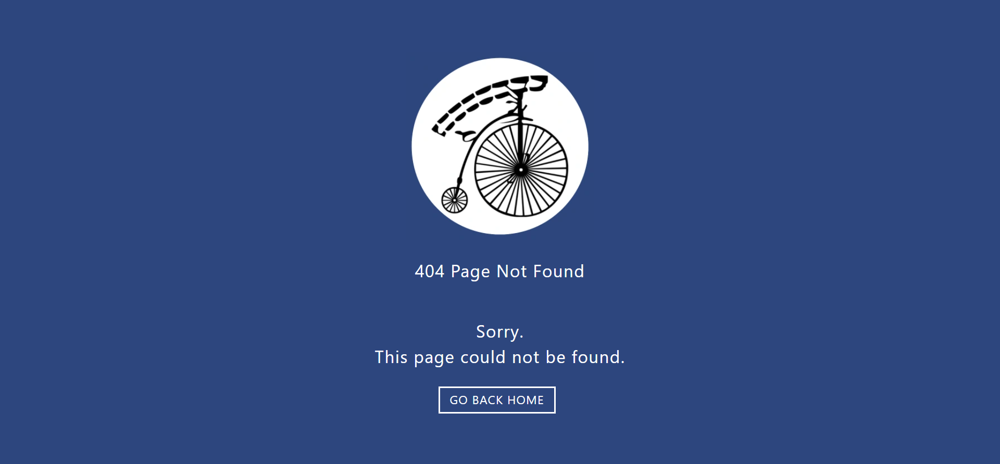

# The Prisoner API

## Description

The Prisoner Zone API allows you to make HTTP requests on the Prisoner television series. This site was created for the documentation of this custom API and provides all of the information needed to start making HTTP requests.

## The Prisoner API Live Link

Please check out the live link for The Prisoner API documentation site here: [The Prisoner API](https://theprisonerapi.netlify.app/ "The Prisoner API")

## API Link

Please go to the API documentation here: [The Prisoner API Documentation](https://github.com/answebdev/the-prisoner-api "The Prisoner API Documentation")

## Technologies Used

* React
* The Prisoner custom-built API
* Prism
* CSS (CSS Modules)
* Flexbox
* React Helmet
* Smoothscroll Polyfill
* Facebook Developer Tools (Sharing Debugger)
* Netlify
* Express (for API)
* Cors (for API)
* Express Rate Limit (for API)
* Postman (for API)
* Vercel (for API)

## Test Site

The following site was created for testing purposes in order to test the API endpoint: [The Prisoner API Test Site](https://the-prisoner-api-js-test.vercel.app/ "The Prisoner API Test Site")

## Screenshots

